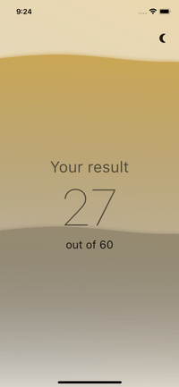

# Capitals

Приложение для нескольких лекций Школы Мобильной Разработки Яндекса 2021 и 2022 годов.

[Demo](https://kltsv.github.io/capitals/capitals/)

  

# Как работает

Приложение показывает картинку и вопрос — сделана ли данная картинка в той или иной столице мира.
Задача пользователя — угадать, соответствует ли предложенная столица показанной картинке.

Всего 30 случайных столиц и максимально 60 баллов.

# Содержание

Процесс написания приложения разбит на три лекции:

## Введение

[Лекция на Youtube](https://www.youtube.com/watch?v=_lAUEYoLZzc)

[Майлстоун с пуллреквестами](https://github.com/kltsv/capitals/milestone/1?closed=1)

1. [Модели, API, Assets](https://github.com/kltsv/capitals/pull/1)
2. [Базовый лейаут, пакет для свайпа карточек](https://github.com/kltsv/capitals/pull/2)
3. [Бизнес-логика, события](https://github.com/kltsv/capitals/pull/3)
4. [Наводим красоту](https://github.com/kltsv/capitals/pull/4)
5. [Завершение игры](https://github.com/kltsv/capitals/pull/5)
6. [Лендскейп](https://github.com/kltsv/capitals/pull/6)
7. [Темная тема](https://github.com/kltsv/capitals/pull/7)

## Архитектура

[Лекция на Youtube](https://www.youtube.com/watch?v=GB8A8hJhHcM)

[Первый майлстоун с пуллреквестами](https://github.com/kltsv/capitals/milestone/2?closed=1)

1. [Распутываем зависимости](https://github.com/kltsv/capitals/pull/8)
2. [Структура проекта](https://github.com/kltsv/capitals/pull/9)
3. [Декомпозиция сущностей](https://github.com/kltsv/capitals/pull/10)
4. [Реактивные состояния](https://github.com/kltsv/capitals/pull/11)
5. [Единый источник зависимостей](https://github.com/kltsv/capitals/pull/12)

[Второй майлстоун с пуллреквестами](https://github.com/kltsv/capitals/milestone/3?closed=1)

1. [GetIt + Injectable](https://github.com/kltsv/capitals/pull/13)
2. [Provider](https://github.com/kltsv/capitals/pull/14)
3. [BLoC](https://github.com/kltsv/capitals/pull/15)
4. [Redux](https://github.com/kltsv/capitals/pull/16)

## Тестирование

[Майлстоун с пуллреквестами](https://github.com/kltsv/capitals/milestone/4?closed=1)

1. [Unit tests](https://github.com/kltsv/capitals/pull/21)
2. [Widget tests](https://github.com/kltsv/capitals/pull/22)
3. [Integration tests](https://github.com/kltsv/capitals/pull/23)
4. [Golden tests](https://github.com/kltsv/capitals/pull/24)